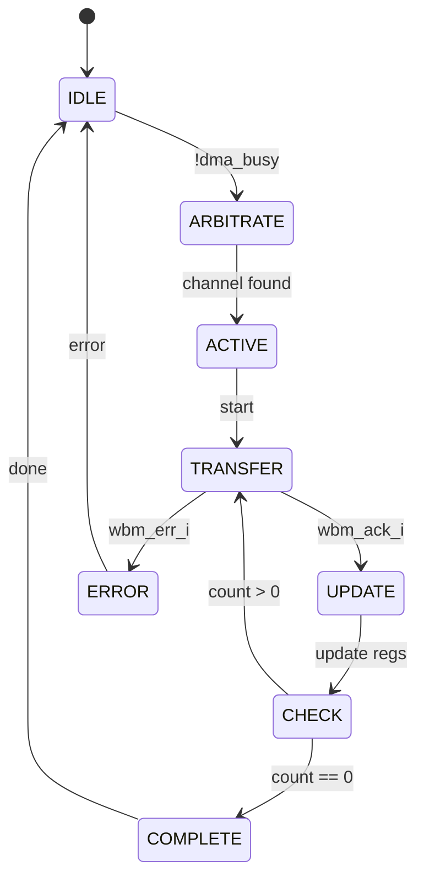

# Документация на DMA Controller (SysDMA)

## 1. Общее описание

SysDMA - 4-канальный контроллер прямого доступа к памяти для Z80-совместимых систем. Обеспечивает высокоскоростную пересылку данных между памятью и периферийными устройствами без участия CPU.

## 2. Архитектурная блок-схема

```
+----------------+       +------------------------------------+
|    CPU         |       |           DMA Controller           |
|                |       | +--------------------------------+ |
| +------------+ |       | |           Arbiter              | |
| | Registers  |<------->| |  Channel 0  Channel 1  ...     | |
| +------------+ | WB    | | |  Registers Registers         | |
|                | Slave | +--------------------------------+ |
+----------------+       | |                                | |
                         | |        DMA Engine              | |
+----------------+       | | +---------------------------+  | |
| Peripheral     |       | | | Address Generation        |  | |
| Devices        |<----->| | | Data Path Control         |  | |
| (UART, FDC)    | DRQ/  | | | Transfer Control          |  | |
+----------------+ DACK  | +-----------------------------+  | |
                         | +--------------------------------+ |
+----------------+       | |           WB Master            | |
|    Memory      |<----->| |                                | |
|    Subsystem   | WB    | +--------------------------------+ |
+----------------+       +------------------------------------+
```

## 3. Интерфейсы сигналов

### 3.1. Тактирование и сброс

- `clk_i` - тактовый сигнал системы
- `rst_i` - сигнал сброса (активный высокий уровень)

### 3.2. Wishbone Slave Interface

- `wbs_adr_i[23:0]` - адрес для доступа к регистрам
- `wbs_dat_i[15:0]` - данные для записи
- `wbs_dat_o[15:0]` - данные для чтения
- `wbs_we_i` - разрешение записи
- `wbs_stb_i` - строб транзакции
- `wbs_cyc_i` - признак цикла
- `wbs_ack_o` - подтверждение транзакции
- `wbs_sel_o` - выбор устройства (генерируется самим DMA)

### 3.3. Wishbone Master Interface

- `wbm_adr_o[23:0]` - адрес для DMA-транзакций
- `wbm_dat_o[15:0]` - данные для записи
- `wbm_dat_i[15:0]` - данные для чтения
- `wbm_we_o` - разрешение записи
- `wbm_stb_o` - строб транзакции
- `wbm_cyc_o` - признак цикла
- `wbm_ack_i` - подтверждение транзакции
- `wbm_err_i` - ошибка транзакции

### 3.4. Интерфейс запросов DMA

- `drq_i[3:0]` - запросы DMA от устройств (активный высокий)
- `dack_o[3:0]` - подтверждения DMA устройствам (активный высокий)

### 3.5. Прерывания

- `irq_o` - запрос прерывания (активный высокий)

## 4. Регистровая карта

### 4.1. Регистры каналов (на каждый канал)

#### Базовый адрес канала: 0x00 + (0x10 * channel_number)

| Адрес | Назначение      | Размер | Описание                      |
|-------|-----------------|--------|-------------------------------|
| 0x00  | SRC_ADDR[15:0]  | 16-bit | Младшие биты адреса источника |
| 0x02  | SRC_ADDR[23:16] | 8-bit  | Старшие биты адреса источника |
| 0x04  | DST_ADDR[15:0]  | 16-bit | Младшие биты адреса приемника |
| 0x06  | DST_ADDR[23:16] | 8-bit  | Старшие биты адреса приемника |
| 0x08  | COUNT[15:0]     | 16-bit | Младшие биты счетчика         |
| 0x0A  | COUNT[23:16]    | 8-bit  | Старшие биты счетчика         |
| 0x0C  | CONTROL         | 8-bit  | Управление каналом            |
| 0x0E  | STATUS          | 8-bit  | Статус канала                 |

### 4.2. Формат регистра CONTROL (0x0C)

```text
Биты 0-1: SRC_CTRL - управление источником
          00 = без инкремента
          01 = инкремент (+1)
          10 = декремент (-1)
          11 = резерв

Биты 2-3: DST_CTRL - управление приемником
          00 = без инкремента
          01 = инкремент (+1)
          10 = декремент (-1)
          11 = резерв

Бит 4:   ENABLE - разрешение канала
          0 = канал отключен
          1 = канал включен

Бит 5:   MODE - режим работы
          0 = Demand mode (по запросу)
          1 = Block mode (блочный)

Биты 6-7: Резерв
```

### 4.3. Формат регистра STATUS (0x0E)

```text
Бит 0: DONE - передача завершена
       0 = передача не завершена
       1 = передача завершена успешно

Бит 1: ERROR - ошибка передачи
       0 = ошибок нет
       1 = ошибка передачи

Биты 2-7: Резерв
```

### 4.4. Общие регистры

| Адрес | Назначение  | Размер | Описание                |
|-------|-------------|--------|-------------------------|
| 0xF0  | IMASK       | 4-bit  | Маска прерываний        |
| 0xF2  | DONE_CLEAR  | 4-bit  | Сброс флагов DONE       |
| 0xF4  | ERROR_CLEAR | 4-bit  | Сброс флагов ERROR      |
| 0xFE  | VERSION     | 8-bit  | Версия/фичи контроллера |

## 5. Диаграмма состояний DMA Engine



## 6. Временные диаграммы

### 6.1. Demand Mode (одна транзакция по запросу)

```text
CLK:    __/  \__/  \__/  \__/  \__/  \__/  \__/  \__
DRQ:    ________/^^^^^^^^^^^^^^^^^^^\_______________
DACK:   ________________/^^^^^^^^^^^\_______________
STB:    ________________/^^^\_______________________
ACK:    ___________________/^^^\____________________
ADDR:   ___________________[A]______________________
DATA:   ___________________[D]______________________
```

### 6.2. Block Mode (передача блока)

```text
CLK:    __/  \__/  \__/  \__/  \__/  \__/  \__/  \__
DRQ:    ________/^^^^^^^^^^^^^^^^^^^^^^^^^^^^^^^^^^^
DACK:   ________/^^^^^^^^^^^^^^^^^^^^^^^^^^^^^^^^^^^
STB:    ________/^^^\___/^^^\___/^^^\___/^^^\_______
ACK:    ___________/^^^\___/^^^\___/^^^\___/^^^\____
ADDR:   ___________[A0]___[A1]___[A2]___[A3]_______
DATA:   ___________[D0]___[D1]___[D2]___[D3]_______
```

## 7. Алгоритм работы

### 7.1. Инициализация канала

1. Записать адрес источника в SRC_ADDR
2. Записать адрес приемника в DST_ADDR  
3. Записать количество transfers в COUNT
4. Настроить биты управления в CONTROL
5. Установить бит ENABLE для запуска

### 7.2. Арбитраж каналов

```python
def arbitrate():
    for channel in range(4):  # fixed priority
        if channel.enabled and not channel.done and not channel.error:
            if channel.mode == BLOCK or drq[channel] == 1:
                return channel
    return None
```

### 7.3. Обработка прерываний

```c
// Обработчик прерывания DMA
void dma_isr() {
    uint8_t status = inport(DMA_STATUS);
    
    // Проверить какой канал вызвал прерывание
    for (int i = 0; i < 4; i++) {
        if (status & (1 << i)) {
            if (dma_error[i]) {
                // Обработка ошибки
                handle_dma_error(i);
            } else {
                // Обработка завершения
                handle_dma_complete(i);
            }
            // Сбросить флаг прерывания
            outport(DMA_INT_CLEAR, 1 << i);
        }
    }
}
```

## 8. Примеры использования

### 8.1. Копирование блока памяти

```c
// Инициализация канала 0 для копирования 1KB
void dma_memcpy(uint24_t src, uint24_t dst, uint24_t size) {
    // Настройка канала 0
    DMA_SRC_ADDR0 = src;
    DMA_DST_ADDR0 = dst; 
    DMA_COUNT0 = size / 2;  // 16-bit transfers
    
    // SRC: инкремент, DST: инкремент, Block mode
    DMA_CTRL0 = (1 << SRC_INC) | (1 << DST_INC) | (1 << MODE_BIT);
    
    // Запуск канала
    DMA_CTRL0 |= (1 << ENABLE_BIT);
}
```

### 8.2. Обслуживание UART по запросу

```c
// Настройка канала 1 для UART RX
void dma_uart_rx_init() {
    DMA_SRC_ADDR1 = UART_DATA_REG;
    DMA_DST_ADDR1 = RX_BUFFER;
    DMA_COUNT1 = BUFFER_SIZE;
    
    // SRC: без инкремента (регистр), DST: инкремент, Demand mode
    DMA_CTRL1 = (1 << DST_INC);
    
    // Разрешить прерывания
    DMA_IMASK = (1 << 1);
    
    // Запуск канала
    DMA_CTRL1 |= (1 << ENABLE_BIT);
}
```

## 9. Особенности реализации

- **Фиксированный приоритет:** Канал 0 > Канал 1 > Канал 2 > Канал 3
- **Автоматическое обновление адресов:** согласно настройкам SRC_CTRL/DST_CTRL
- **Обработка ошибок:** автоматическое прекращение передачи при wbm_err_i
- **Софтверный сброс:** флаги DONE и ERROR сбрасываются записью в соответствующие регистры

## 10. Версии и совместимость

- **Версия 1.0:** Базовая функциональность (текущая)
- **Планируется:** Поддержка цепочек дескрипторов, более сложные режимы арбитража

Эта документация обеспечивает полное понимание работы DMA контроллера и позволяет быстро начать его использование в системе.
