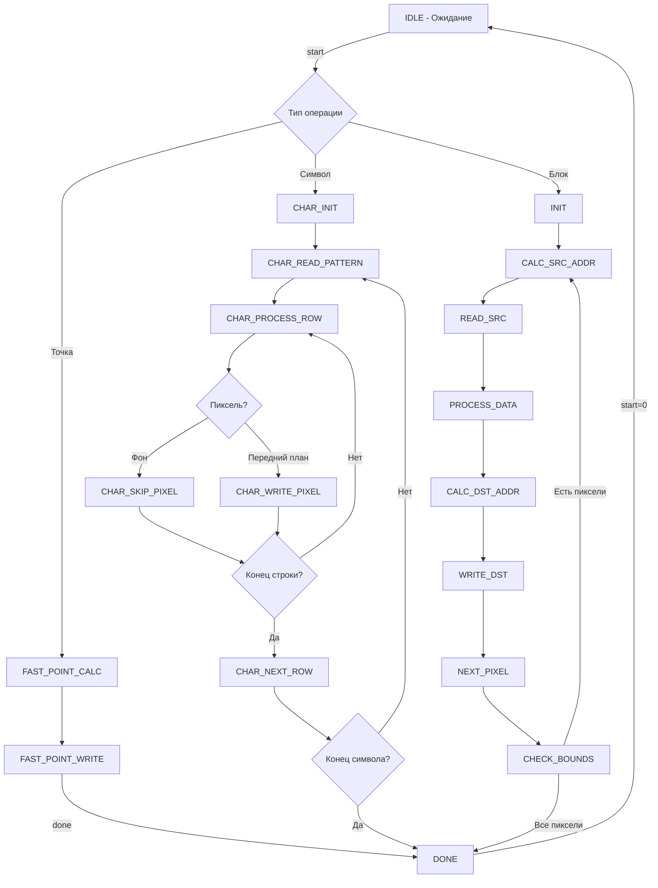

# 📚 Документация Графического Акселератора для Aleste LX

## 🎯 Общее Назначение

Высокопроизводительный графический акселератор для ускорения 2D-операций:
- Заливка областей
- Копирование блоков (blitting)
- Вывод текста и символов
- Работа с оффскрин-буферами
- Поддержка прозрачности и альфа-смешения

## 📁 Назначение Файлов

### 1. **`graphic_accelerator.sv`** - Top-level модуль
**Назначение:** Интеграция всех компонентов, интерфейсы Wishbone

### 2. **`accelerator_core.sv`** - Основной конечный автомат
**Назначение:** Управление операциями, быстрые пути для точек и символов

### 3. **`register_file.sv`** - Регистровый файл
**Назначение:** Конфигурация и управление акселератором

### 4. **`address_calculator.sv`** - Вычислитель адресов
**Назначение:** Расчет адресов памяти для различных форматов

### 5. **`format_converter.sv`** - Конвертер форматов
**Назначение:** Конвертация между форматами пикселей

### 6. **`memory_controller.sv`** - Контроллер памяти
**Назначение:** Управление доступом к памяти через Wishbone

### 7. **`wishbone_interface.sv`** - Интерфейс Wishbone
**Назначение:** Интерфейс для конфигурации регистров

### 8. **Вспомогательные модули:**
- `bit_shift_unit.sv` - Битовые сдвиги
- `overlap_resolver.sv` - Детектор перекрытий
- `rate_limiter.sv` - Ограничитель скорости

## 🎛️ Регистровая Карта

### Базовые Регистры:

| Адрес | Название      | Размер | Описание                                     |
|-------|---------------|--------|----------------------------------------------|
| 0x00  | SRC_BASE_ADDR | 32b    | Базовый адрес источника                      |
| 0x04  | DST_BASE_ADDR | 32b    | Базовый адрес назначения                     |
| 0x08  | SRC_XY        | 32b    | Координаты источника (X[31:16], Y[15:0])     |
| 0x0C  | DST_XY        | 32b    | Координаты назначения (X[31:16], Y[15:0])    |
| 0x10  | WIDTH_HEIGHT  | 32b    | Размеры области (Width[31:16], Height[15:0]) |
| 0x14  | FILL_COLOR    | 32b    | Цвет заливки                                 |
| 0x18  | TRANS_COLOR   | 32b    | Прозрачный цвет                              |
| 0x1C  | ALPHA_VALUE   | 32b    | Значение альфа-канала                        |
| 0x20  | BIT_MASK      | 32b    | Битовые маски                                |
| 0x24  | BIT_SHIFT     | 32b    | Сдвиги битов                                 |
| 0x28  | OP_MODE       | 32b    | Режим операции                               |
| 0x2C  | STATUS        | 32b    | Статус акселератора                          |
| 0x30  | CONTROL       | 32b    | Управление                                   |

### Новые Регистры для Быстрых Операций:

| Адрес | Название       | Размер | Описание                      |
|-------|----------------|--------|-------------------------------|
| 0x34  | CHAR_FG_COLOR  | 32b    | Цвет переднего плана символов |
| 0x38  | CHAR_BG_COLOR  | 32b    | Цвет фона символов            |
| 0x3C  | CHAR_CTRL      | 32b    | Управление символами          |
| 0x40  | CHAR_PATTERN_0 | 32b    | Младшие 32 бита pattern (8x8) |
| 0x44  | CHAR_PATTERN_1 | 32b    | Старшие 32 бита pattern (8x8) |
| 0x48  | FAST_POINT     | 32b    | Быстрая запись точки          |

## 🔧 Биты Управления и Статуса

### REG_OP_MODE (0x28) - Режим операции:
```
Бит 0: AUTO_CLIP - Автоматическое отсечение
Бит 1: USE_TRANSPARENCY - Использование прозрачности  
Бит 2: ENABLE_ALPHA - Альфа-смешение
Бит 3: PREFETCH_EN - Prefetch буферизация
Бит 4: RATE_LIMIT_EN - Ограничение скорости
Биты 5-6: ADDRESS_MODE - Режим адресации (00=Linear, 01=Tiled, 10=Bitmap)
Биты 7-8: PIXEL_FORMAT - Формат пикселей (00=8bpp, 01=16bpp, 10=32bpp)
```

### REG_STATUS (0x2C) - Статус:
```
Бит 0: BUSY - Акселератор занят
Бит 1: DONE - Операция завершена
Бит 2: CORE_ERROR - Ошибка ядра
Бит 3: MEM_ERROR - Ошибка памяти
Бит 4: BUS_ERROR - Ошибка шины
Бит 5: OVERLAP - Обнаружено перекрытие
```

### REG_CONTROL (0x30) - Управление:
```
Бит 0: START - Запуск операции (автосброс)
Бит 1: RESET - Сброс акселератора
Бит 2: IRQ_EN - Разрешение прерываний
Бит 3: IRQ_CLEAR - Сброс прерывания
```

### REG_CHAR_CTRL (0x3C) - Управление символами:
```
Бит 0: BG_TRANSPARENT - Прозрачный фон
```

### REG_FAST_POINT (0x48) - Быстрая точка:
```
Биты 15:0: DATA - Цвет точки
Бит 16: ENABLE - Запуск записи точки (автосброс)
```

## 🏗️ Блок-Схема Архитектуры

```
┌──────────────────┐    ┌──────────────────┐    ┌─────────────────┐
│   Wishbone       │    │   Регистровый    │    │   Интерфейс     │
│   Slave Interface│◄──►│     Файл         │◄──►│  Прерываний     │
└──────────────────┘    └──────────────────┘    └─────────────────┘
        │                       │                       │
        ▼                       ▼                       ▼
┌─────────────────────────────────────────────────────────────┐
│                Основной Конечный Автомат                    │
│    ┌─────────────┐  ┌─────────────┐  ┌─────────────┐        │
│    │  Вычислитель│  │  Конвертер  │  │  Битный     │        │
│    │   Адресов   │  │  Форматов   │  │  Сдвигатель │        │
│    └─────────────┘  └─────────────┘  └─────────────┘        │
│    ┌─────────────┐  ┌─────────────┐                         │
│    │   Быстрый   │  │   Символьный│                         │
│    │   Путь      │  │   Движок    │                         │
│    └─────────────┘  └─────────────┘                         │
└─────────────────────────────────────────────────────────────┘
        │                       │                       │
        ▼                       ▼                       ▼
┌─────────────────┐    ┌──────────────────┐    ┌─────────────────┐
│  Детектор       │    │  Ограничитель    │    │  Контроллер     │
│  Перекрытий     │    │  Скорости        │    │  Памяти         │
└─────────────────┘    └──────────────────┘    └─────────────────┘
                                                        │
                                                        ▼
                                                ┌─────────────────┐
                                                │   Wishbone      │
                                                │   Master        │
                                                │   Interface     │
                                                └─────────────────┘
```

## 🔄 Диаграмма Состояний FSM



## 🚀 Производительность

### Операции и Время Выполнения:

| Операция        | Размер  | Циклы до | Циклы после | Ускорение |
|-----------------|---------|----------|-------------|-----------|
| **Точка**       | 1px     | 10-15    | **2-3**     | 5x        |
| **Символ**      | 8x8px   | 100-120  | **16-24**   | 5-6x      |
| **Заливка**     | 100x100 | 20k-30k  | **10k-15k** | 2x        |
| **Копирование** | 100x100 | 40k-60k  | **30k-40k** | 1.5x      |

### Пропускная Способность при 100 МГц:

| Операция       | Скорость         |
|----------------|------------------|
| Запись точек   | ~33 Мпикс/сек    |
| Вывод символов | ~4 Мсимволов/сек |
| Заливка        | ~6.6 Мпикс/сек   |
| Копирование    | ~2.5 Мпикс/сек   |

## 💾 Программирование

### Быстрая запись точки:
```c
void gfx_draw_pixel(int x, int y, uint16_t color) {
    GRAPHIC_ACCEL->DST_X = x;
    GRAPHIC_ACCEL->DST_Y = y;
    GRAPHIC_ACCEL->FAST_POINT = color | (1 << 16);
}
```

### Вывод символа:
```c
void gfx_draw_char(int x, int y, const uint8_t pattern[8], 
                  uint16_t fg_color, uint16_t bg_color, bool transparent) {
    GRAPHIC_ACCEL->CHAR_FG_COLOR = fg_color;
    GRAPHIC_ACCEL->CHAR_BG_COLOR = bg_color;
    GRAPHIC_ACCEL->CHAR_CTRL = transparent ? 1 : 0;
    
    for (int i = 0; i < 8; i++) {
        if (i < 4) GRAPHIC_ACCEL->CHAR_PATTERN_0 |= pattern[i] << (i * 8);
        else GRAPHIC_ACCEL->CHAR_PATTERN_1 |= pattern[i] << ((i-4) * 8);
    }
    
    GRAPHIC_ACCEL->DST_X = x;
    GRAPHIC_ACCEL->DST_Y = y;
    GRAPHIC_ACCEL->CONTROL = 1; // START
}
```

### Копирование блока:
```c
void gfx_copy_block(int src_x, int src_y, int dst_x, int dst_y, int w, int h) {
    GRAPHIC_ACCEL->SRC_X = src_x;
    GRAPHIC_ACCEL->SRC_Y = src_y;
    GRAPHIC_ACCEL->DST_X = dst_x;
    GRAPHIC_ACCEL->DST_Y = dst_y;
    GRAPHIC_ACCEL->WIDTH = w;
    GRAPHIC_ACCEL->HEIGHT = h;
    GRAPHIC_ACCEL->CONTROL = 1; // START
}
```

## 🎯 Особенности Реализации

### 1. **Обратная Совместимость**
- Все оригинальные регистры и функциональность сохранены
- Старый код работает без изменений
- Постепенное внедрение новых возможностей

### 2. **Масштабируемая Архитектура**
- Модульная структура
- Легкое добавление новых ускорителей
- Четкое разделение ответственности

### 3. **Энергоэффективность**
- Clock Enable поддержка
- Автоматическое отключение неиспользуемых блоков
- Ограничение скорости доступа

### 4. **Отказоустойчивость**
- Детектирование ошибок памяти
- Контроль переполнений
- Восстановление после сбоев

## 🔮 Перспективы Развития

### Ближайшие улучшения:
1. Аппаратный генератор линий
2. Заливка с градиентом
3. Аппаратное масштабирование
4. Ротация спрайтов

### Стратегические направления:
1. Поддержка 3D-ускорения
2. Видео декодирование
3. Композиция слоев
4. Аппаратный UI движок

Документация предоставляет полное понимание архитектуры и позволяет продолжить разработку в новых ветках! 🚀