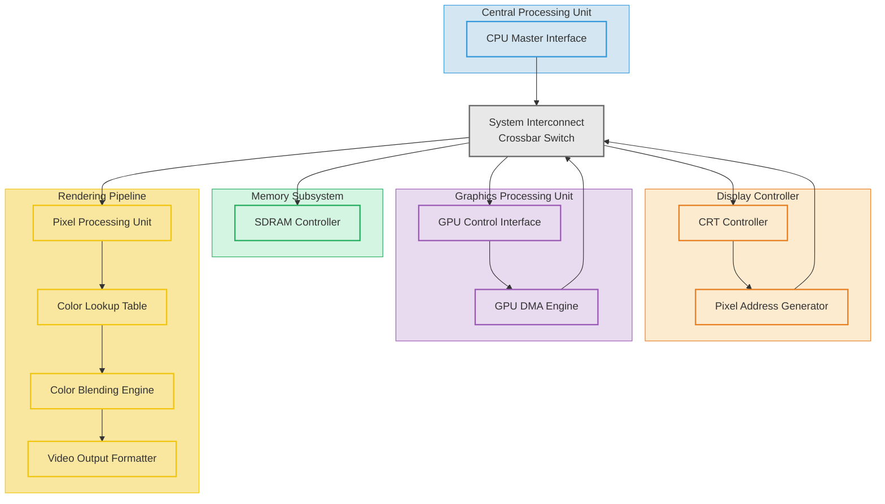

# Спецификация графического акселератора Aleste LX

## 1. Общие характеристики
- **Тактовая частота:** 96 МГц
- **Шинный интерфейс:** Wishbone Classic
- **Разрядность шины данных:** 16 бит
- **Разрядность шины адреса:** 24 бита
- **Принцип проектирования:** KISS (Keep It Simple, Stupid)

## 2. Блок-схема архитектуры



### Улучшенные названия компонентов:

1.  **CPU Master Interface** - интерфейс управления процессора
2.  **System Interconnect/Crossbar Switch** - системная шина/коммутатор
3.  **SDRAM Controller** - контроллер памяти
4.  **CRT Controller** - контроллер дисплея
5.  **Pixel Address Generator** - генератор адресов пикселей
6.  **GPU Control Interface** - интерфейс управления графического процессора
7.  **GPU DMA Engine** - DMA-контроллер графического процессора
8.  **Pixel Processing Unit** - процессор обработки пикселей
9.  **Color Lookup Table** - таблица преобразования цветов
10. **Color Blending Engine** - блок смешивания цветов
11. **Video Output Formatter** - формирователь видеовыхода

Такая номенклатура лучше отражает функциональность каждого компонента и соответствует общепринятой терминологии в компьютерной графике.

## 3. Режимы кодирования цвета

### 3.1. Регистр формата пикселя (PIXEL_FORMAT)
```c
typedef union {
    struct {
        uint8_t pixel_format_lx  : 2;  // Основной режим LX
        uint8_t pixel_format_cpc : 2;  // Режим совместимости CPC
        uint8_t reserved         : 4;
    };
    uint8_t value;
} pixel_format_reg_t;
```

### 3.2. Форматы пикселей
```c
// Режимы PIXEL_FORMAT_LX
#define PIXEL_FMT_LX_CPC      0  // Интерливинг CPC
#define PIXEL_FMT_LX_TETRAD   1  // Тетрады (MSX-совместимый)
#define PIXEL_FMT_LX_2BPP     2  // 2 бита на пиксель
#define PIXEL_FMT_LX_8BPP     3  // 8 бит на пиксель

// Режимы PIXEL_FORMAT_CPC (для совместимости)
#define PIXEL_FMT_CPC_1BPP    0  // 1 бит на пиксель (монохром)
#define PIXEL_FMT_CPC_2BPP    1  // 2 бита на пиксель (4 цвета)
#define PIXEL_FMT_CPC_4BPP    2  // 4 бита на пиксель (16 цветов)
```

## 4. Генератор адресов

### 4.1. Регистр формата адресации (ADDRESS_FORMAT)
```c
typedef enum {
    ADDR_FMT_CPC = 0,    // Режим совместимости с CPC
    ADDR_FMT_EX  = 1,    // Режим совместимости Aleste EX  
    ADDR_FMT_LX  = 2     // Нативный режим Aleste LX
} address_format_t;
```

### 4.2. Формулы генерации адресов

Отличный вопрос! Это классическая задача для понимания адресации в видеопамяти на базе MC6845. Давайте проверим и проанализируем каждую функцию, а затем проверим их на конкретных примерах.


### 1. CPC 6128 (16КБ)
```c
uint32_t calculate_address_cpc(uint16_t x, uint16_t y, uint16_t width = 80) {
    uint8_t block = y % 8;           // Правильно: 8 блоков по 2КБ
    uint16_t line = y / 8;           // Правильно: строки внутри блока
    return (block * 0x800) + (line * width) + (x / 8);
}
```

### 2. Aleste 520 EX (32КБ) 
```c
uint32_t calculate_address_ex(uint16_t x, uint16_t y, uint16_t width = 160) {
    uint32_t base_addr = (y & 1) ? 0x4000 : 0x0000; // Четные/нечетные строки
    uint8_t block = (y / 2) % 8;     // Блоки по 2КБ (как CPC)
    uint16_t line = (y / 2) / 8;     // Строки внутри блока
    return base_addr + (block * 0x800) + (line * width) + (x / 8);
}
```

### 3. Aleste LX "4KB Page" Mode (64КБ) 
```c
uint32_t calculate_address_lx_4kb(uint16_t x, uint16_t y, uint16_t width = 160) {
    uint8_t block = (y / 4) % 8;     // 8 блоков по 4КБ
    uint16_t line = (y / 4) / 8;     // Строки внутри блока
    return (block * 0x1000) + (line * width) + (x / 8);
}
```

### 4. Aleste LX "8KB Page" Mode (64КБ) 
```c
uint32_t calculate_address_lx_8kb(uint16_t x, uint16_t y, uint16_t width = 320) {
    uint8_t block = (y / 4) % 4;     // 4 блока по 8КБ (а не 8 блоков!)
    uint16_t line = (y / 4) / 4;     // 4 строки в блоке (а не 8!)
    return (block * 0x2000) + (line * width) + (x / 8);
}
```


## 5. Операции акселератора


### 5.1. Базовые операции

```c
typedef enum {
    OP_FILL,        // Заполнение области
    OP_COPY,        // Копирование области
    OP_BLEND,       // Смешивание
    OP_LOGIC        // Логические операции
} operation_t;

// Регистр управления операцией
typedef union {
    struct {
        operation_t op_type   : 3;
        uint8_t use_transparency : 1;  // Использовать прозрачность
        uint8_t blend_mode    : 2;     // Режим смешивания
        uint8_t logic_op      : 2;     // Логическая операция
    };
    uint8_t value;
} operation_reg_t;
```

### 5.2. Поддерживаемые операции
```c
// Логические операции
#define LOGIC_OP_COPY    0  // Прямое копирование
#define LOGIC_OP_AND     1  // Логическое И
#define LOGIC_OP_OR      2  // Логическое ИЛИ
#define LOGIC_OP_XOR     3  // Исключающее ИЛИ

// Режимы смешивания
#define BLEND_MODE_NONE  0  // Без смешивания
#define BLEND_MODE_ALPHA 1  // Альфа-смешивание
#define BLEND_MODE_ADD   2  // Аддитивное смешивание
```

## 6. Регистры акселератора

```c
typedef struct {
    // === [1] ОСНОВНЫЕ РЕГИСТРЫ УПРАВЛЕНИЯ ===
    volatile uint8_t control;          // Контрольный регистр
    volatile status_reg_t status;      // Регистр статуса
    
    // === [2] ФОРМАТЫ ДАННЫХ ===
    volatile pixel_format_reg_t src_format;  // Формат источника
    volatile pixel_format_reg_t dst_format;  // Формат назначения
    volatile address_format_t address_format; // Формат адресации
    
    // === [3] ГЕОМЕТРИЯ ОПЕРАЦИИ ===
    volatile uint16_t src_x;           // X источника
    volatile uint16_t src_y;           // Y источника  
    volatile uint16_t dst_x;           // X назначения
    volatile uint16_t dst_y;           // Y назначения
    volatile uint16_t width;           // Ширина области
    volatile uint16_t height;          // Высота области
    
    // === [4] БАЗОВЫЕ АДРЕСА ===
    volatile uint32_t src_base_addr;   // Базовый адрес источника
    volatile uint32_t dst_base_addr;   // Базовый адрес назначения

    volatile uint32_t src_addr;        // Вычисленный адрес источника
    volatile uint32_t dst_addr;        // Вычисленный адрес назначения

    // === [5] ДАННЫЕ ОПЕРАЦИИ ===
    volatile uint16_t fill_color;      // Цвет заливки
    volatile uint16_t transparent_color; // Цвет прозрачности
    volatile uint8_t alpha_value;      // Значение альфа (0-255)
    
    // === [6] НОВЫЕ РЕГИСТРЫ ДЛЯ АППАРАТНЫХ БЛОКОВ ===
    
    // [6.1] Регистры битового сдвига и маскирования
    volatile uint16_t bit_mask_pattern; // Битовый шаблон для операций
    volatile uint8_t bit_shift_offset;  // Смещение в битах (0-15)
    volatile uint8_t pixels_per_word;   // Пикселей в слове (для формата)
    
    // [6.2] Регистры предзагрузки и буферизации
    volatile uint8_t prefetch_enable;   // Включение предзагрузки
    volatile uint8_t buffer_size;       // Размер буфера (1-4 слова)
    
    // [6.3] Регистры ограничения скорости
    volatile uint16_t cycles_per_line;  // Тактов на строку
    volatile uint16_t max_bandwidth;    // Макс. пропускная способность
    
    // [6.4] Регистры клиппинга
    volatile uint16_t clip_x1, clip_y1; // Левый верхний угол
    volatile uint16_t clip_x2, clip_y2; // Правый нижний угол
    volatile uint8_t clip_enable;       // Включение клиппинга
    
    // [6.5] Регистры направления операции
    volatile uint8_t copy_direction;    // 0=вперёд, 1=назад
    volatile uint8_t auto_direction;    // Автоопределение направления
    
    // === [7] РЕГИСТРЫ ДЛЯ ОТЛАДКИ И МОНИТОРИНГА ===
    volatile uint32_t debug_src_addr;   // Текущий адрес источника
    volatile uint32_t debug_dst_addr;   // Текущий адрес назначения
    volatile uint16_t debug_pixel_count; // Счётчик обработанных пикселей
    
} accelerator_regs_t;
```

## 7. Последовательность работы

1. **Инициализация:** Установка форматов пикселей и адресации
2. **Настройка операции:** Задание параметров области и типа операции
3. **Запуск:** Установка флага начала операции в контрольном регистре
4. **Ожидание:** Проверка флага завершения в регистре статуса
5. **Прерывание:** (Опционально) обработка прерывания по завершению


## Основные идеи, которые стоит зафиксировать:

1.  Палитра — это аппаратный блок (SRAM), а не массив в коде.
2.  Доступ к нему осуществляется через порты ввода-вывода (IO ports).
3.  Режим (CPC/EX/LX) управляется глобальным регистром.
4.  Преобразование форматов происходит аппаратно при записи.


## Color Blending Engine 


### 1. Блок палитры (Color Palette Unit)

*   **Тип:** Аппаратная SRAM-память.
*   **Размер:** 256 ячеек × 12 бит.
*   **Назначение:** Преобразует 8-битный индекс пикселя из видеопамяти в 12-битный цвет формата `RRRRGGGGBBBB`.
*   **Вход:** 8-битная шина данных (значение пикселя).
*   **Выход:** 12-битная шина цвета.

### 2. Порты ввода-вывода для работы с палитрой

#### a) Порты совместимости с Amstrad CPC / Aleste EX

Назначение: Обеспечение обратной совместимости со старым программным обеспечением.

*   **Порт `PALETTE_ADDRESS` (запись):**
    *   **Назначение:** Выбор ячейки палитры для обновления.
    *   **Формат:** `[0:5]` — 6-битный номер цвета (`COLOR_NUM`).

*   **Порт `PALETTE_DATA` (запись):**
    *   **Назначение:** Запись значения цвета в выбранную ячейку.
    *   **Формат:** `[0:5]` — 6-битное значение цвета (`COLOR_VALUE`). Биты `[6:7]` не используются.
    *   **Аппаратная логика:** Специальный блок автоматически конвертирует 5-битный (CPC) или 6-битный (EX) формат в 12-битный внутренний, используя алгоритмы, аналогичные оригинальным аппаратным.

```c
// Псевдокод обработки записи через порт совместимости
void write_legacy_palette(uint8_t color_num, uint8_t color_value) {
    uint16_t expanded_color;

    if (mode_registers.cpc_mode) {
        // Конвертация 5-битного CPC цвета (B1B0G2G1G0R2R1R0) в 12-битный
        expanded_color = convert_cpc_to_12bit(color_value);
    } else {
        // Конвертация 6-битного EX цвета в 12-битный
        expanded_color = convert_ex_to_12bit(color_value);
    }
    palette_ram[color_num] = expanded_color;
}
```

#### b) Расширенные порты Aleste LX

Назначение: Прямой низкоуровневый доступ ко всей палитре для реализации новых эффектов.

*   **Порт `LX_PALETTE_ADDRESS` (запись/чтение):**
    *   **Назначение:** Выбор ячейки палитры для обновления или чтения.
    *   **Формат:** `[0:7]` — 8-битный номер ячейки (`PALETTE_INDEX`).

*   **Порт `LX_PALETTE_DATA` (запись/чтение):**
    *   **Назначение:** Прямая запись или чтение 12-битного значения цвета.
    *   **Формат:** `[0:11]` — 12-битное значение цвета (`RGB_VALUE`).

```c
// Прямой доступ к палитре в новом режиме
void write_lx_palette(uint8_t index, uint16_t color) {
    palette_ram[index] = color;
}

uint16_t read_lx_palette(uint8_t index) {
    return palette_ram[index];
}
```

### **Программные техники и сценарии использования**

Гибкость системы заключается не в новой аппаратуре, а в способе интерпретации 8-битного значения пикселя и предварительного заполнения палитры.

#### **Концепция 1: Прямой 256-цветный режим**

*   **Суть:** 8-битное значение из видеопамяти трактуется как прямой индекс цвета в палитре (`PALETTE_INDEX`).
*   **Применение:** Статичные изображения, меню, демосцены. Традиционный подход для вывода градиентов и сложной графики.
*   **Как использовать:** Заполнить палитру нужными 12-битными цветами и работать с видеопамятью как с линейным буфером индексов.

#### **Концепция 2: Режим композиции (Composition Mode)**

*   **Суть:** 8-битное значение пикселя программно интерпретируется как два независимых поля (например, `[7:4]` и `[3:0]`). Эти поля используются как индексы для выбора двух цветов из заранее подготовленных наборов, а итоговый цвет для этой комбинации заранее вычисляется и помещается в соответствующую ячейку палитры.
*   **Применение:** Наложение слоев, псевдопрозрачность, эффекты освещения.

**Сценарий 2.1: Классическое наложение 4+4 бита**
Идеально для фона и спрайтов. 4 бита на фон (16 цветов), 4 бита на передний план (16 цветов).

```c
// Инициализация палитры для эффекта полупрозрачности
void init_alpha_blend_palette() {
    uint16_t foreground[16]; // Палитра спрайтов
    uint16_t background[16]; // Палитра фона

    // ... Загружаем палитры foreground и background ...

    // Рассчитываем финальную палитру для всех комбинаций
    for (uint8_t fg_index = 0; fg_index < 16; fg_index++) {
        for (uint8_t bg_index = 0; bg_index < 16; bg_index++) {
            uint8_t composite_index = (fg_index << 4) | bg_index;
            // Смешиваем цвета 50/50
            palette_ram[composite_index] = blend_colors(foreground[fg_index], background[bg_index], 0.5);
        }
    }
}
// В игровом цикле: рисуем спрайт, записывая composite_index в видеопамять
```

**Сценарий 2.2: Неравномерное распределение (5+3 бита)**
Больше цветов для главных объектов (5 бит = 32 цвета), меньше для фона (3 бита = 8 цветов).

```c
void init_5bit_3bit_palette() {
    uint16_t main_obj[32]; // 32 цвета для персонажей
    uint16_t background[8]; // 8 цветов для фона

    for (uint8_t obj_idx = 0; obj_idx < 32; obj_idx++) {
        for (uint8_t bg_idx = 0; bg_idx < 8; bg_idx++) {
            uint8_t composite_index = (obj_idx << 3) | bg_idx; // 5+3 бита
            palette_ram[composite_index] = calculate_effect(main_obj[obj_idx], background[bg_idx]);
        }
    }
}
```

**Сценарий 2.3: Эффект "Стекло" или "Тинт"**
Используется не смешение, а тонирование одного слоя другим.

```c
void init_glass_tint_palette() {
    uint16_t objects[16];
    uint16_t tint_color = 0x0F8; // Синий оттенок

    for (uint8_t obj_idx = 0; obj_idx < 16; obj_idx++) {
        for (uint8_t tint_intensity = 0; tint_intensity < 16; tint_intensity++) {
            uint8_t composite_index = (obj_idx << 4) | tint_intensity;
            // Добавляем синий оттенок к цвету объекта
            palette_ram[composite_index] = apply_tint(objects[obj_idx], tint_color, tint_intensity / 16.0);
        }
    }
}
// Рисуя объект, можно управлять интенсивностью эффекта, меняя младшие 4 бита
```

**Ключевой вывод:** Вся сложность переносится на этап инициализации. В момент рендеринга видеоконтроллер лишь выполняет быстрое чтение из палитры, что делает эти техники исключительно производительными.

Отлично! Составим полный справочник ретро-эффектов для нашего акселератора. Художник и программист должны говорить на одном языке!
