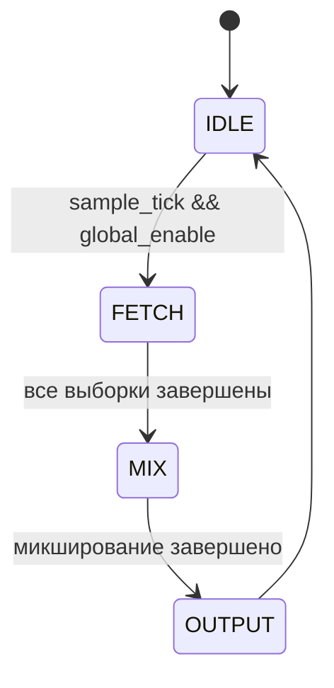
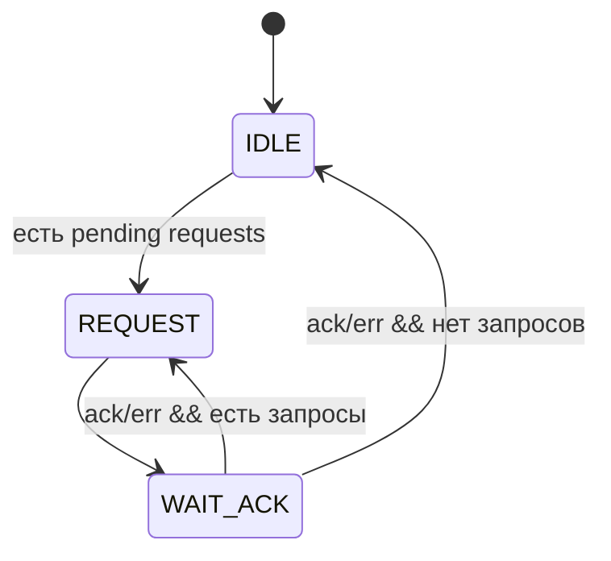
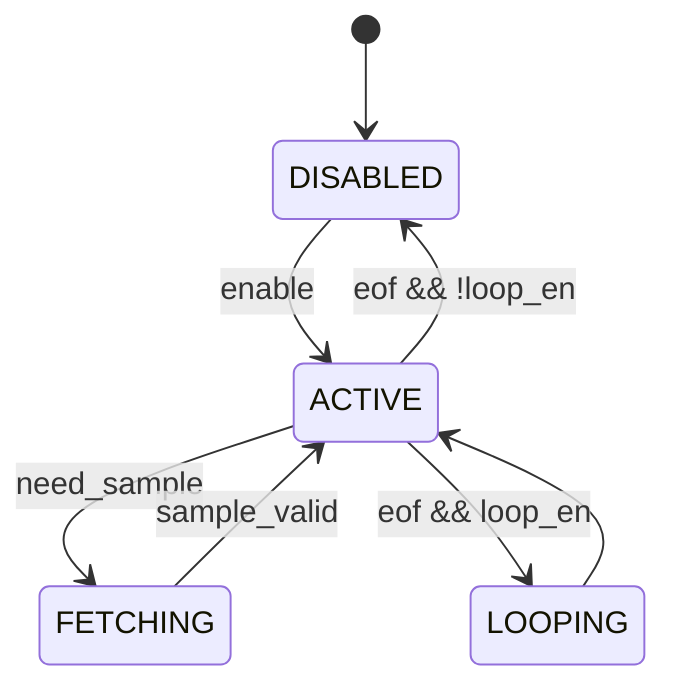

# Документация на звуковой процессор Magic Sound 2

## 1. Обзор архитектуры

Magic Sound 2 - это 4-канальный DMA-контроллер звука с поддержкой интерполяции и микширования. Процессор предназначен для воспроизведения сэмплов из памяти с изменяемой частотой.

### Блок-схема архитектуры
```
┌─────────────────┐    ┌─────────────────┐    ┌─────────────────┐
│   Z80 CPU       │    │   Memory        │    │   I2S Output    │
│   Interface     │◄──►│   Controller    │◄──►│   Transmitter   │
└─────────────────┘    └─────────────────┘    └─────────────────┘
        │                       │                       │
        ▼                       ▼                       ▼
┌─────────────────┐    ┌─────────────────┐    ┌─────────────────┐
│   Register      │    │   Channel       │    │   Mixer &       │
│   Bank (256B)   │    │   Processors    │    │   Interpolator  │
└─────────────────┘    └─────────────────┘    └─────────────────┘
        │                       │                       │
        ▼                       ▼                       ▼
┌─────────────────┐    ┌─────────────────┐    ┌─────────────────┐
│   Timer &       │    │   Address       │    │   Volume        │
│   Interrupt     │    │   Generators    │    │   Control       │
│   Controller    │    └─────────────────┘    └─────────────────┘
└─────────────────┘
```

## 2. Технические характеристики

- **Каналы**: 4 независимых DMA-канала
- **Разрядность адреса**: 24 бита (16 МБ адресное пространство)
- **Разрядность сэмпла**: 16 бит
- **Формат адреса**: 24.16 fixed-point (аккумулятор)
- **Частота дискретизации**: 96 кГц
- **Тактовая частота**: 100 МГц
- **Интерфейс**: Wishbone (8-bit slave, 16-bit master)
- **Выход**: I2S ( stereo)

## 3. Регистровая карта

### 3.1. Глобальные регистры

| Адрес | Название | Назначение | Биты |
|-------|----------|------------|------|
| 0x00 | GLOBAL_CTRL | Global Control | [0]: Global Enable<br>[1]: Reset<br>[2-7]: Reserved |
| 0x01 | GLOBAL_VOL_L | Global Left Volume | [0-7]: Volume (0-255) |
| 0x02 | GLOBAL_VOL_R | Global Right Volume | [0-7]: Volume (0-255) |
| 0x03 | STATUS | Status Register | [0]: Global Active<br>[1]: Any Channel Active<br>[2]: Any Error<br>[3]: Any EOF<br>[4]: DMA Error<br>[5]: Timer IRQ |
| 0x04 | IRQ_CTRL | Interrupt Control | [0]: Timer IRQ Enable<br>[1]: DMA Error NMI Enable<br>[2-7]: Reserved |
| 0x05 | DMA_ERR_CLR | DMA Error Clear | Write 1 to clear error flags |

### 3.2. Таймер регистры

| Адрес | Название | Назначение |
|-------|----------|------------|
| 0x10 | TIMER_VAL | Timer Value LSB |
| 0x11 | TIMER_VAL_H | Timer Value MSB |
| 0x12 | TIMER_CTRL | Timer Control |

### 3.3. Регистры каналов (по 16 регистров на канал)

**Базовые адреса:**
- Канал 0: 0x20-0x2F
- Канал 1: 0x30-0x3F  
- Канал 2: 0x40-0x4F
- Канал 3: 0x50-0x5F

| Offset | Название | Назначение | Биты |
|--------|----------|------------|------|
| 0x0 | CH_CTRL | Channel Control | [0]: Enable<br>[1]: Loop Enable<br>[2]: Ping-Pong<br>[3]: IRQ on EOF<br>[7:4]: Left Volume<br>[3:0]: Right Volume |
| 0x1 | START_ADDR_0 | Start Address LSB | [0-7]: Address byte 0 |
| 0x2 | START_ADDR_1 | Start Address Middle | [0-7]: Address byte 1 |
| 0x3 | START_ADDR_2 | Start Address MSB | [0-7]: Address byte 2 |
| 0x4 | END_ADDR_0 | End Address LSB | [0-7]: Address byte 0 |
| 0x5 | END_ADDR_1 | End Address Middle | [0-7]: Address byte 1 |
| 0x6 | END_ADDR_2 | End Address MSB | [0-7]: Address byte 2 |
| 0x7 | LOOP_START_0 | Loop Start LSB | [0-7]: Address byte 0 |
| 0x8 | LOOP_START_1 | Loop Start Middle | [0-7]: Address byte 1 |
| 0x9 | LOOP_START_2 | Loop Start MSB | [0-7]: Address byte 2 |
| 0xA | LOOP_END_0 | Loop End LSB | [0-7]: Address byte 0 |
| 0xB | LOOP_END_1 | Loop End Middle | [0-7]: Address byte 1 |
| 0xC | LOOP_END_2 | Loop End MSB | [0-7]: Address byte 2 |
| 0xD | STEP_0 | Frequency Step LSB | [0-7]: Step byte 0 |
| 0xE | STEP_1 | Frequency Step Middle | [0-7]: Step byte 1 |
| 0xF | STEP_2 | Frequency Step MSB | [0-7]: Step byte 2 |

## 4. Математические выражения

### 4.1. Расчет шага частоты
```
step = (desired_frequency << 16) / sample_rate
```
Пример для 44000 Гц при 96000 Гц:
```
step = (44000 << 16) / 96000 ≈ 0x70A3 (в формате 16.16)
```

### 4.2. Генерация адреса
```
address_accumulator += step
current_address = address_accumulator[39:16] // целая часть
fraction = address_accumulator[15:0]        // дробная часть
```

### 4.3. Линейная интерполяция
```
interpolated_sample = previous_sample + fraction * (current_sample - previous_sample) / 65536
```

### 4.4. Микширование с насыщением
```
mixed_sample = clamp(∑(channel_sample * channel_volume * global_volume), -32768, 32767)
```

## 5. Диаграммы состояний

### 5.1. Главный конечный автомат


### 5.2. Конечный автомат WB Master


### 5.3. Конечный автомат канала


## 6. Временные диаграммы

### 6.1. Цикл чтения Wishbone
```
clk_i      __/  \__/  \__/  \__/  \__/  \__/  \__
wbm_cyc_o ________/                               \________
wbm_stb_o ________/                               \________  
wbm_adr_o ________________[ADDR]___________________________
wbm_dat_i _________________________[DATA]__________________
wbm_ack_i _________________________/   \___________________
```

### 6.2. Цикл обработки сэмпла
```
clk_i      __/  \__/  \__/  \__/  \__/  \__/  \__/  \__
sample_tick ________/                           \________
state      IDLE    FETCH        MIX         OUTPUT  IDLE
ch_req     ________/   \____________________________
ch_ack     ________________/   \____________________
mix_valid  ___________________________/   \_________
i2s_data   ___________________________________/   \__
```

### 6.3. I2S передача данных
```
clk_i      __/  \__/  \__/  \__/  \__/  \__/  \__
i2s_bclk   _/ \_/ \_/ \_/ \_/ \_/ \_/ \_/ \_/ \_/
i2s_lrclk  _______________/               \_______
i2s_data   ____[MSB]...[LSB]____[MSB]...[LSB]____
           (Left channel)     (Right channel)
```

## 7. Примеры программирования

### 7.1. Инициализация канала
```asm
; Канал 0: воспроизведение сэмпла 44000 Гц
ld a, %10010001       ; Enable + Loop + Vol L=9, Vol R=1
ld (REG_CH0_CTRL), a

ld a, 0x00           ; Start address = 0x100000
ld (REG_CH0_START0), a
ld a, 0x00
ld (REG_CH0_START1), a  
ld a, 0x10
ld (REG_CH0_START2), a

ld a, 0xFF           ; End address = 0x100FFF
ld (REG_CH0_END0), a
ld a, 0x0F
ld (REG_CH0_END1), a
ld a, 0x10
ld (REG_CH0_END2), a

ld a, 0xA3           ; Step = 44000/96000 ≈ 0.45833
ld (REG_CH0_STEP0), a
ld a, 0x70
ld (REG_CH0_STEP1), a
ld a, 0x00
ld (REG_CH0_STEP2), a
```

### 7.2. Глобальная настройка
```asm
; Включить глобально, установить громкость
ld a, 0x01
ld (REG_GLOBAL_CTRL), a
ld a, 0xFF           ; Max volume
ld (REG_GLOBAL_VOL_L), a
ld a, 0xFF
ld (REG_GLOBAL_VOL_R), a
```

## 8. Обработка ошибок

### 8.1. Типы ошибок:
- **DMA Error**: Ошибка чтения из памяти
- **Address Error**: Выход за границы памяти
- **Configuration Error**: Неверная конфигурация регистров

### 8.2. Обработка прерываний:
- **IRQ**: Музыкальный таймер (300 Гц)
- **NMI**: Критические ошибки DMA

## 9. Особенности производительности

- **Задержка**: 4 такта от sample_tick до вывода I2S
- **Пропускная способность**: 96,000 сэмплов/сек × 4 канала = 384,000 операций/сек
- **Потребление памяти**: 256 байт регистров + внутренние буферы

## 10. Применение

Идеально подходит для:
- Воспроизведения цифрового звука в 8-битных системах
- Синтеза музыки с multiple tracking
- Sound effects в игровых консолях
- Процессоров эффектов в аудио оборудовании

Данная документация предоставляет полное описание архитектуры, программирования и работы звукового процессора Magic Sound 2.