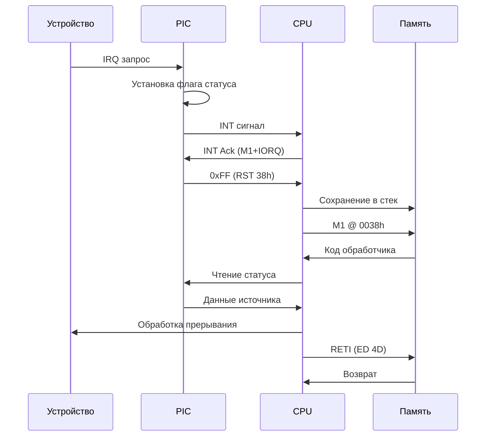

# Спецификация: Иерархический Контроллер Прерываний Z80

## Архитектурный обзор

Система прерываний построена по двухуровневой иерархической модели:
- **Уровень 1:** Центральный диспетчер (Master PIC) - определяет "КТО прервал"
- **Уровень 2:** Периферийные контроллеры - определяют "ЧТО именно случилось"

## Базовые регистры (порты 0xFC0020-0xFC002F)

- `0xFC0023` - Базовый вектор (Vector Register)
- `0xFC0024-0xFC0025` - Статус прерываний (расширенный)
- `0xFC0026-0xFC0027` - Маска прерываний (расширенная)  
- `0xFC0028-0xFC0029` - Очистка pending прерываний

## Регистр Статуса (Status Register) - Read Only

| Бит | Сигнал      | Группа устройств         | Описание                          |
|-----|-------------|--------------------------|-----------------------------------|
|     |             | **Не маскируемые**       |                                   |
| 15  | `SUPER_BTN` | Системные кнопки         | Аварийный вызов супервизора       |
| 14  | `BUS_CRASH` | Системная шина           | Нарушение целостности шины        |
| 13  | `EXT_SLOT`  | Внешние слоты расширения | Таймаут или ошибка внешнего слота |
| 12  |             |                          |                                   |
| 11  |             |                          |                                   |
| 10  |
| 9   |             |                          |                                   |
| 8   |             |                          |                                   |
| 7   |             |                          |                                   |
| 6   | `SYSTIMER`  |                          |                                   |
| 5   | `IPC`       |                          |                                   |
| 4   | `LEGACY`    | Устаревшая периферия     | CTC, VDP, старый UART             |
| 3   | `AUDIO`     | Аудио подсистема         | Звуковой контроллер               |
| 2   | `GPU`       | Графический контроллер   | VBlank, HBlank, рендер            |
| 1   | `DMA_COM`   | DMA и коммуникации       | DMA-контроллер, сетевой интерфейс |
| 0   | `STORAGE`   | Накопители и порты       | FDC, IDE/SD, современный UART     |

## Регистр Маски (Mask Register) - R/W 

Бит `1` - прерывание разрешено, `0` - заблокировано

## Регистр Подтверждения (Acknowledge Register) - Write Only

Запись `1` в бит сбрасывает соответствующий флаг статуса

## 3. Механизмы Активации Супервизора

### Аппаратные механизмы:
1. **INT (маскируемое)** - основное прерывание периферии
2. **NMI (немаскируемое)** - аварийные события
3. **RST n** - программные прерывания

### Программные механизмы:
4. **Порт управления** - принудительное переключение
5. **Ошибки доступа** - защитные механизмы

## 4. Протокол обработки прерывания

## 5. Приоритетная обработка

Приоритет по убыванию:
1. NMI (кнопка супервизора, краш шины)
2. EXT_SLOT (ошибки расширения)
3. GPU (графические события)
4. AUDIO (звуковые буферы)
5. DMA_COM (передачи данных)
6. STORAGE (накопители)
7. LEGACY (устаревшие устройства)

## 6. Регистры отладки

**Порт 0xDF - Отладочный регистр**
- Бит 0: Лог прерываний включен
- Бит 1: Статистика обработки
- Бит 2: Трассировка стека
- Биты 3-7: Зарезервировано

Такая структура документации лучше отражает иерархическую архитектуру и делает акцент на взаимодействии между уровнями системы.